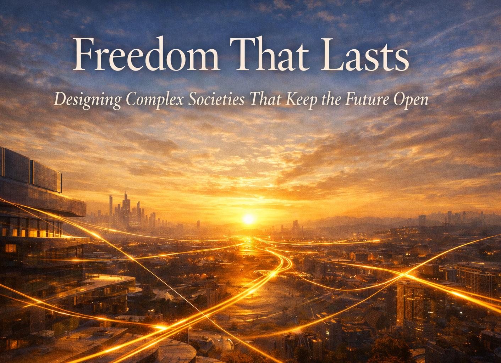
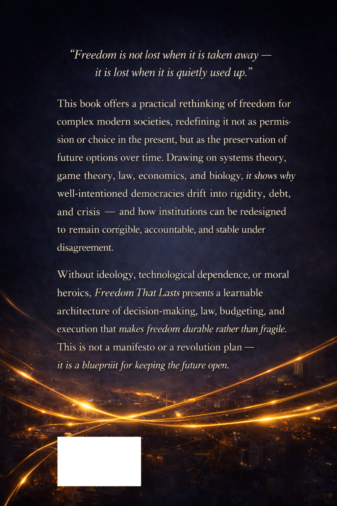
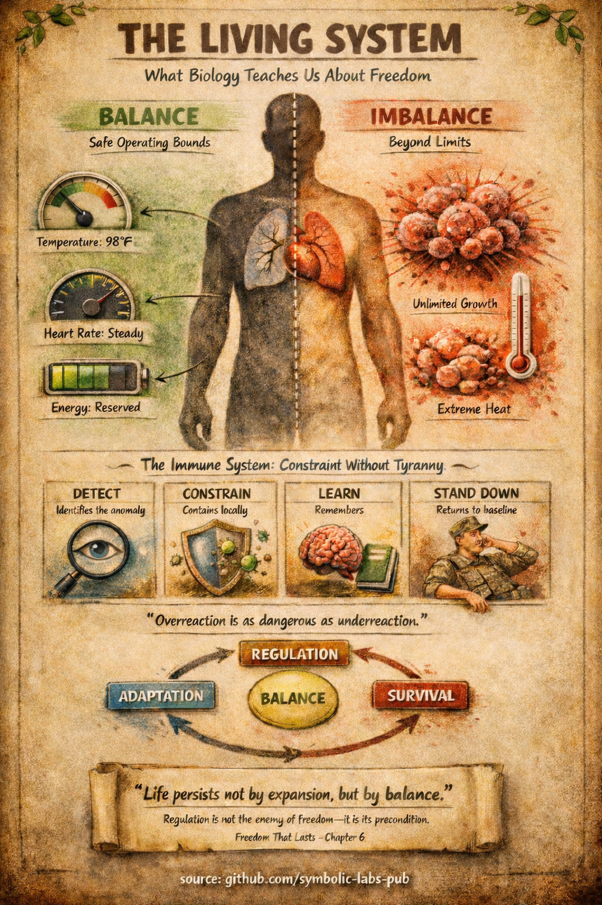
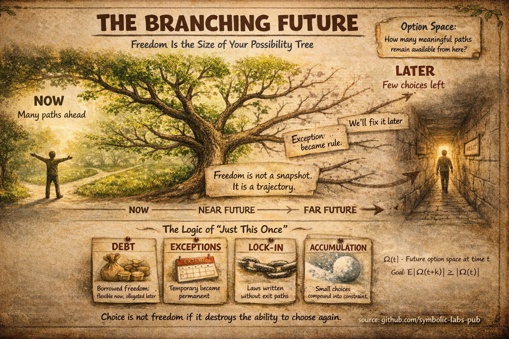
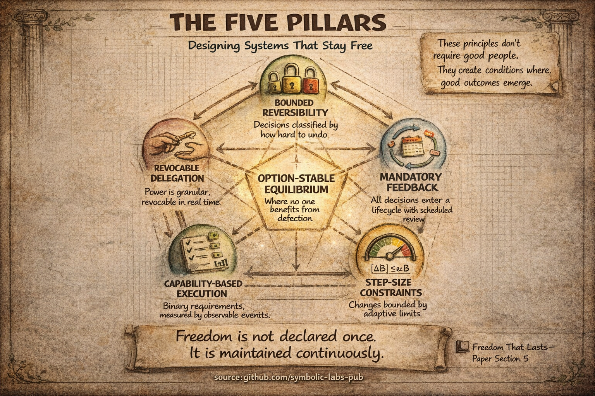

# [Freedom That Lasts](https://github.com/symbolic-labs-pub/freedom-that-lasts?tab=readme-ov-file#freedom-that-lasts)

Designing Complex Societies That Keep the Future Open

## Scientific Paper
- of the [theory](docs/paper.md).

## Whitepaper Series

- I. [Academic](docs/whitepapers/academic.md) – theory, game theory, systems
- II. [Policy / Institutional](docs/whitepapers/policy_and_institutional.md) – governance, legitimacy, transition
- III. [Technical / Engineering](docs/whitepapers/technical.md) – architecture, algorithms, control loops
- IV. [Common Sense](docs/whitepapers/common_sense.md) – meaning, intuition, trust

This is a **stack** — concept → institution → system → story.

## Documentation

- [Technical Overview](docs/TECHNICAL_OVERVIEW.md)
- [Thread Model](THREAT_MODEL.md)
- [Architecture](docs/ARCHITECTURE.md)
- [Paper](docs/paper.md)

## The Book

Read synopsis for 
- [Business](docs/synopsises/business.md)
- [Policy](docs/synopsises/policy.md)
- [Common Sense](docs/synopsises/common_sense.md)
- [Academy](docs/synopsises/academy.md)

### **Author’s Note**

I did not write this book to convince you of a political position.

I wrote it because, for years, I felt a quiet unease that many people recognize but struggle to name. The sense that we argue constantly about politics while changing very little. That participation is intense, yet outcomes feel strangely detached. That decisions pile up faster than anyone seems able to correct them.

What struck me was that this frustration appeared across political beliefs, professions, and countries. It wasn’t about left or right, optimism or pessimism. It was about systems that no longer seemed to learn.

This book grew out of an attempt to understand that feeling without blaming voters, leaders, or ideology. I became interested less in *what* societies decide, and more in *how decisions behave over time*. Why some choices quietly lock in consequences for decades, while others remain flexible. Why well-intentioned actions can narrow the future without anyone meaning to.

You won’t find slogans or easy villains here. What you will find is a different way of thinking about freedom—not as something we defend once, but as something we maintain continuously. Closer to health than to victory.

My hope is not that you agree with every idea in these pages. It’s that the book gives you a new lens—one that makes certain patterns visible, and certain questions harder to ignore.

If it changes how you think about decisions, even slightly, then it has done its job.

## Buy the [book](https://amazon-book-link)!

Read the [first chapter](docs/first_chapter.pdf) for free! (TODO: can this be done without violating aws publisher rules?)

Visit the Amazon [Bookstore](https://amazon-book-link) for [hardcover](https://amazon-book-link), [paperback](https://amazon-book-link) and [Kindle e-book](https://amazon-book-link) versions.

# TODO: update amazon kdp urls!

| Front                                                                                                                     | Back                                                                                                                    |
|---------------------------------------------------------------------------------------------------------------------------|-------------------------------------------------------------------------------------------------------------------------|
  |  
| [Order the book](https://amazon_book_link)                                                                                | [Visit Amazon Bookstore](https://amazon_book_link)                                                          |
## Notes

- [A Note on Consensus](docs/notes/consensus.md)
- [Founder Operating Principles Preserving Optionality](original_documentation/Founder_Operating_Principles_Preserving_Optionality.pdf)

## Press

- [**Press Kit**](docs/press_kit)

| [Freedom of Living Beings](docs/press_kit/infographics/01a_Freedom_of_Living_Beings_in_Fahrenheit.png)                                                                                        | [Freedom in the Future](docs/press_kit/infographics/02_Freedom_in_the_Future.png)                                                                                                                             | [Freedom by the Pillars](docs/press_kit/infographics/03_Freedom_by_the_Pillars.png)                                                                                                                               |
|-----------------------------------------------------------------------------------------------------------------------------------------------------------------------------------------------|-------------------------------------------------------------------------------------------------------------------------------------------------------|----------------------------------------------------------------------------------------------------------------------------------------------------------|
|  |  |  |

## Contribution

- Call of Universities, Academy and Research & Development for creative, intuitive visualizations in [3D](https://threejs.org/examples/) of the budget, 
- optionally interactively welcome members, citizens to manage intentional direction actions in step sizes.
- Research and visualize the a/b/c feeds
- TODO: Tutorials with example on how to
- Editing, printing folding of the book: the current typography is a catastrophe, I stated it good enough when formulas happend to be rendered properly. All editing, publishing and such is more than welcome. Manuscript is available in markdown.
- Persistence adapters.

## Codebase Health

  

---

**Fun Fact**: The average lifespan of a democracy is around 200 years. This framework aims to extend that by making freedom structurally stable, not just aspirational.

---
